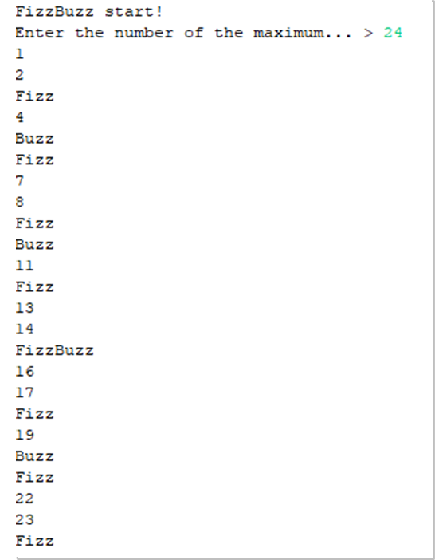

# Day1-1
FizzBuzzを書いて，とりあえずみんなで語ろう。

## FizzBuzzって？
1から順に数を数え上げていき，3の倍数なら「Fizz」5の倍数なら「Buzz」両方の倍数なら「FizzBuzz」と出力するもの。
今回は，Scannerによる入力の受け付けで，どの数字まで出力するかを決められるようにしましょう。
とりあえず，15分間で形にしてみましょ。出力例は以下のような感じ。

## 言語ごとに使える機能は変わる
シンプルにわかりやすき記述するということはとても重要だが，どんなプログラムが読みやすいかは，どんな考え方でプログラムを書いているかによる。
授業で出てくるプログラムは凄く工夫をされたプログラムではない可能性があるが，それはテクニックを入れれば入れるほど初心者お断りになるからである。
受講生の学習タイミング（セメスター），レベル感などから工夫されていくものなので，とりあえずみんなのプログラムを見比べてみたい。
善いものがあれば自分に取り入れればいいし，シンプルに書いていても分かりにくければ採用は見送ったほうが良いでしょう。
分かりにくいものも，学習が進めば分かりやすくなる可能性もある。楽しんでいきましょう。

## F3
Eclipseの面白機能。F3を押すと，そのクラスやメソッドの定義に飛ぶことができる。
とりあえず，System.outのprintlnメソッド見に行きましょう。
